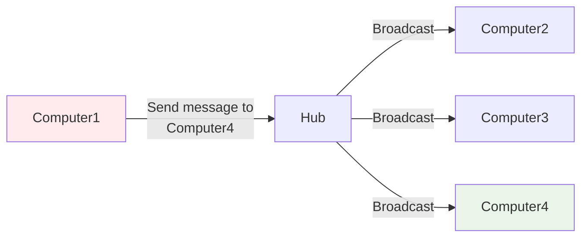

#### **Overview

[[Internet Network Flow.canvas|Internet Network Flow]] components connects each other and performance.
1. [[#**Hub|Hub]]
2. Switch
3. Router
4. Firewall
5. Modem
6. Fiber
7. Outside Network or Internet

#### **Hub
Hub is get connected with multiple computers and devices together,  whenever the Signal or message from source ip it broadcast to all the connected devices which does not store the 
MAC Address of the devices.

