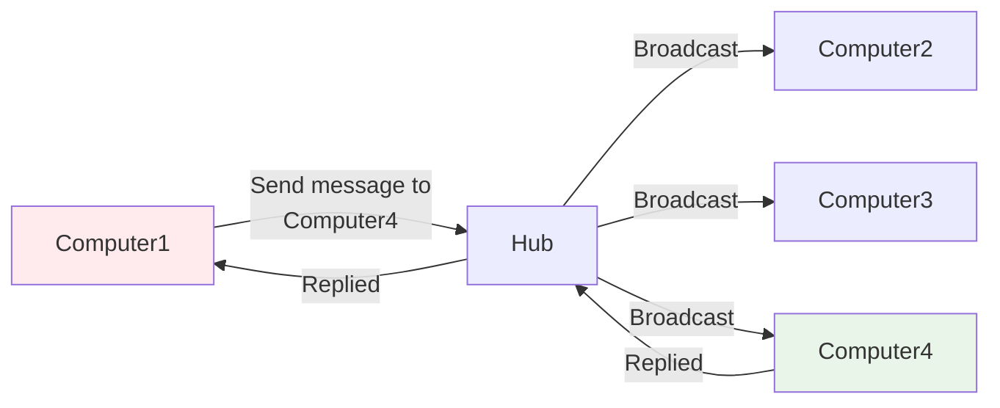
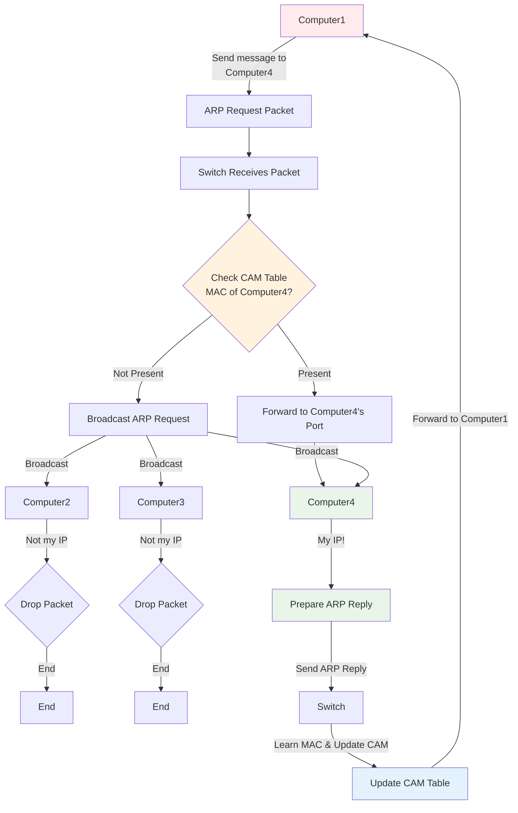
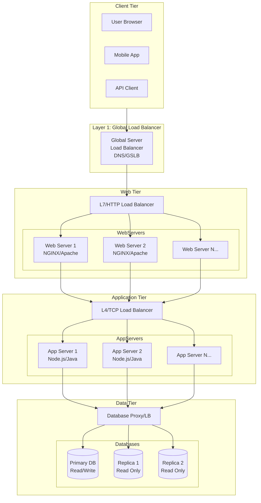

#### **Overview

[[Internet Network Flow.canvas|Internet Network Flow]] components connects each other and performance.
1. [[#**Hub|Hub]]
2. [[#Switch|Switch]]
3. Router
4. Firewall
5. Gateway
6. Modem
7. Fiber
8. Outside Network or Internet

#### **Hub
- Hub is get connected with multiple computers and devices together,  whenever the Signal or message from source ip it broadcast to all the connected devices get back from only destination Ip's devices, and it's not store that ip and mac address of the devices. This happens every time.

MAC Address of the devices.

#### **Switch
- It's more likes HUB but it has brained, so it's stores the mac address of the device in **CAM 
(Content Addressable Memory)** table.
- Steps and procedure of the switch
	1. A device want to sent message or ping another device in same subnet or different subnet. It get convert into ARP(Address Resolver Protocol) Packets and sent to switch.
	2. Switch received the ARP packets checks the CAM(Content Addressable Memory) table to find the mac address of the device. If it exist send message to device.
	3. If not available switch broadcast to connected device to get mac address, even if it router also.
	4. When the Ip exist the system its returns the ip and mac address to switch.
	5. Now, switch stores the ip and mac address, and returns message or ping response to source system.

	#### **Notes
	1.  Switch only perform mac address not ip address.
	2. It's a 2nd network layer.
	3. There three reason switch broadcast,
		1. When destination's mac address does not known.
		2. When Multicast get involved.
		3. When APR sends to broadcast mac address to switch.
	4. We can connect multiple switch in same environment.
	5. Ask doubt, single switch can support subnet or not? Yes

#### **Router
- Router passthrough the ip to neighbour network or firewall or internet based on configuration.
- It also use broadcast when DHCP (Dynamic Host Configuration Protocol) does not knows ip.
 #### **Responsibilities
 1. Forward request to neighbour subnet/network.
 2. 

// Todo future.....

#### **Load balancing

