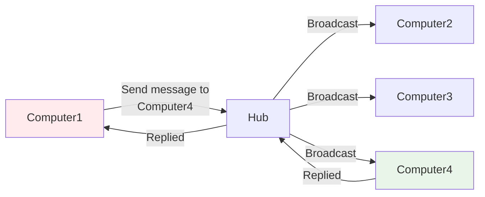

#### **Overview

[[Internet Network Flow.canvas|Internet Network Flow]] components connects each other and performance.
1. [[#**Hub|Hub]]
2. [[#Switch|Switch]]
3. Router
4. Firewall
5. Modem
6. Fiber
7. Outside Network or Internet

#### **Hub
- Hub is get connected with multiple computers and devices together,  whenever the Signal or message from source ip it broadcast to all the connected devices get back from only destination Ip's devices, and it's not store that ip and mac address of the devices. This happens every time.

MAC Address of the devices.

#### **Switch
- It's more likes HUB but it has brained, so it's stores the mac address of the device in **CAM 
(Content Addressable Memory)** table.
- A device wants to sent message to another connected device via IP address but switch can knows only the mac address of the device, so here ARP(Address Resolver Protocol) get helps to resolve the mac address of the device.
- 